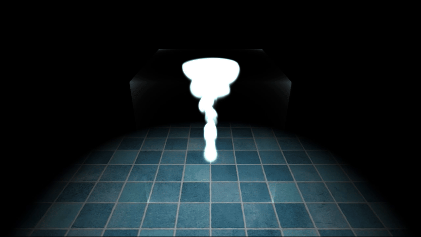

### Hi, I'm Luke Philipps!
I'm a graphics programmer with professional experience in software and Unity XR development. My current focuses include DirectX 12 pipelines, URP shaders, and screen space post-processing effects.

Feel free to check out some of my projects below!

  

  

 

